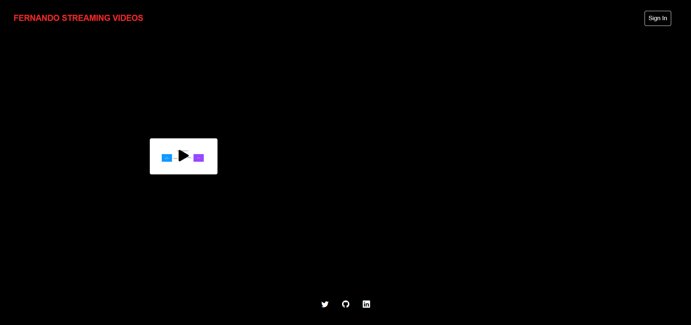
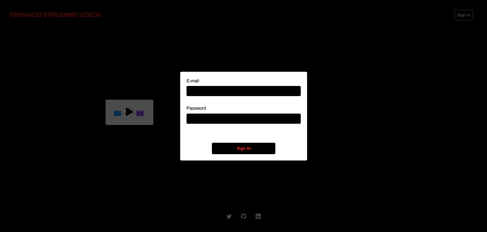
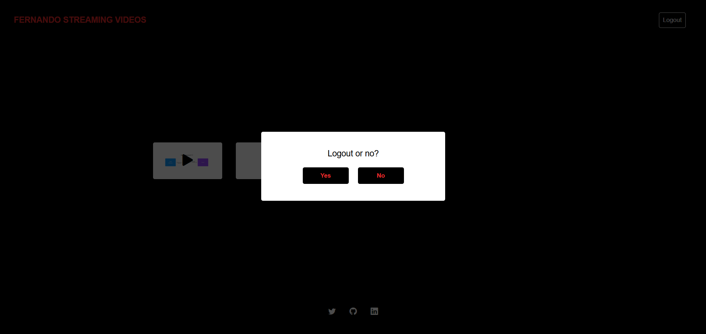
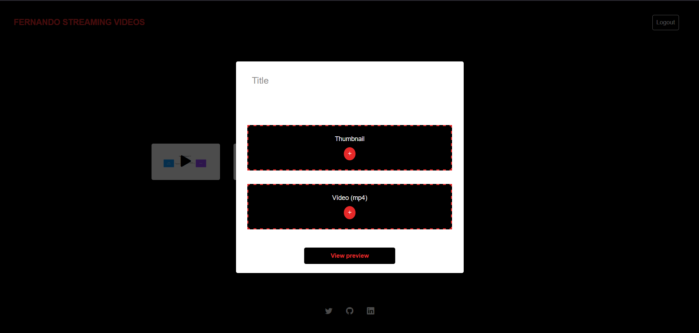
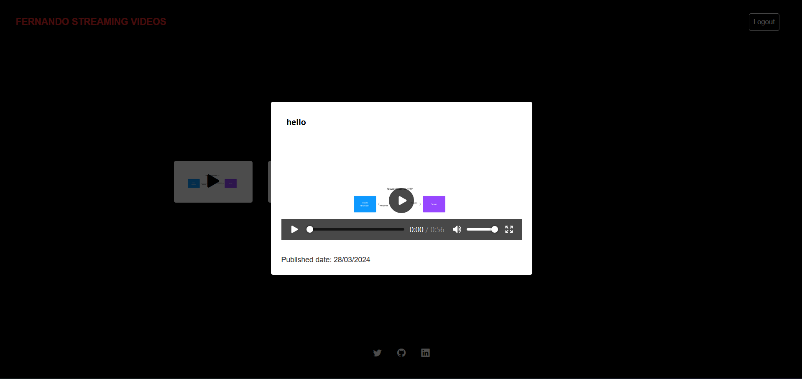

# Fernando Streaming Videos

## Sobre
Este projeto tem como intuito ser um local eu posso hospedar os meus vídeos, 
possibilitando as pessoas poderem assisti-los. 

## Tecnologias usadas

- HTML5
- CSS3
- Typescript
- Vite
- Node

## Serviços

- Firebase
- Vercel

## Prints

Obs:. O login só é acessível ao dono do projeto.

Link do site: https://fernando-streaming-videos.vercel.app